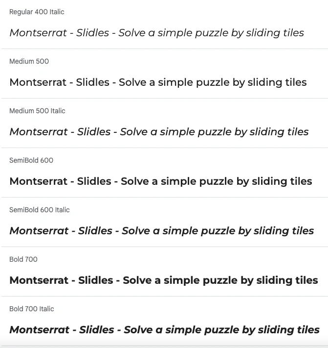
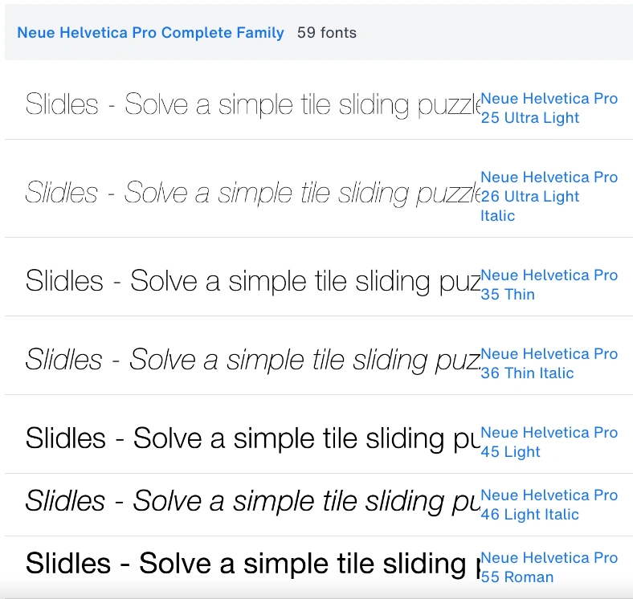

# Slidles

Welcome to Slidles, a vibrant puzzle game designed to keep your brain engaged with quick, stausfying challenges. Slidles combines the classic sliding tile puzzle with a fresh, minimalist design, allowing for clean and easy navigation to solve our simple puzzles. Escape the complexity of modern life for a few minutes with our bright, eye-catching graphics and clean, intuitive interface. Slidles offers a refreshing experience for players of all ages. Each puzzle is engaging and rewarding, ensuring fun for both novice and seasoned puzzlers. Happy Sliding!

[View Slidles Live Here]()

Shields.io badges

## Table of Contents
1. [User Experience (UX)](#user-experience)
    - [Project Goals](#project-goals)
    - [User stories](#user-stories)
    - [Target Audience Goals](#target-audience-goals)
    - [Site Owner Goals](#site-owner-goals)
    - [First Time User Goals](#first-time-user-goals)
    - [Return User Goals](#return-user-goals)
2. [Design](#design)
    - [Design Philosophy](#design-philosophy)
    - [Design Choices](#design-choices)
    - [Colour Scheme](#colour-scheme)
    - [Typography](#typography)
    - [Imagery](#imagery)
    - [Wireframes](#wireframes)
    - [Structure](#structure)
    - [The 5 Elements](#the-5-elements)
3. [Features](#features)
    - [Logo](#logo)
    - [Favicon](#favicon)
    - [Header](#header)
    - [Main Content](#main-content)
    - [Footer](footer)
    - [Technologies Utilised](#technologies-utilised)
    - [Languages](#languages)
    - [Frameworks and Programs](#frameworks-and-programs)
5. [Deployment](#deployment)
    - [Remote Deployment](#remote-deployment)
    - [Local Deployment](#local-deployment)
6. [Testing](#testing)
    - [Validation Testing](#validation-testing)
    - [Manual Testing](#manual-testing)
7. [Bugs and Fixes](#bugs-and-fixes)
8. [Finished Product](#finished-product)
9. [Future Features](#future-features)
10. [Credits](#credits)
    - [Content and Code](#content-and-code)
    - [Media](#media)
11. [Conclusion](#conclusion)
12. [Acknowledgements](#acknowledgements)

## User Experience (UX)
Our primary focus is on creating a seamless, enjoyable user experience. Slidles is designed with simplicity in mind, ensuring that users can navigate and play without any hassle. The vibrant design elements enhance engagement, making the puzzle-solving experience delightful and satisfying.

## Project Goals

## User Stories

## Target Audience Goals

## Site Owner Goals

## First Time User Goals

## Return User Goals

## Design 

### Design Philosophy
Our design philosophy centres on simplicity, vibrancy and user engagement. We believe that a clean aesthetically pleasing design enhances the user's focus on the puzzle itself.

### Design Choices
- **Minimalist Layout**: Ensures the focus remains on the puzzle.
- **Responsive Design**: Provides a seamless experience across all devices.
- **Interactive Elements**: Engages users through dynamic feedback.

- **References**
For my sliding puzzle project, I've drawn inspiration from a blend of traditional sliding puzzles and the minimalist elegance of Pantone Colour swatches. The clean lines and abstract forms of Picasso's line drawings contribute to the aesthetic. The puzzle itselp is like a polaroid snapshot, while the engaging interactivity of New York Times games inspire and shape the user experience. This fusion of artistic and functional elements create a uniquely captivating and visually appealing puzzle game.

- ### Colour Scheme
A bright and vibrant colour scheme is used to make the game visually stimulating. Colours are carefully chosen to create a balance between aesthetics and functionality.

- **Colour Palette**
The colour palette fir this site was devised in keeping with the original SLIDLES logo and created in [Adobe Color](https://color.adobe.com/).

- **Logo**
The Slidles logo is an original creation using Adobe Illustrator and a starting point for the clean appearance of the puzzle and website.

- ### Typography
Clear, easy-to-read fonts complement the vibrant design without distracting from gameplay.

- **Fonts**
The font Montserrat was carefully chosen and imported from [Google Fonts](https://fonts.google.com/).
Neue-Helvetica was used in keeping with design inspiration.
Monospace was employed so the timer and moves section were not moving around page whilst incrementing

- ### Imagery

- **Content Hero Images**
All images were orignially created, optimised and converted to webp with [Convertio](https://convertio.co/).

### Wireframes
Wireframes serve as the blueprint for the website, outlining the layout and functionality of each page. They help us visualise the user experience and iterate on design concepts and scope before implementation.

Wireframes for this site were created with [Figma](https://figma.com/).

- **Sketch Wireframes**

- **Mobile, Tablet, Desktop Wireframes**

### Structure
The structure of Slidles is designed for a seamless and intuitive user experience, with clear content hierarchy, consistent navigation and responsive design principle.

### The 5 Elements
1. **Strategy**: Offering a classic puzzle game with a modern twist.
2. **Scope**: Focusing on a single, well-designed puzzle game.
3. **Structure**: Clear navigation and intuitive gameplay.
4. **Skeleton**: Wireframes ensure a user-friendly layout.
5. **Surface**: Bright, vibrant design elements create an engaging experience.

## Features

### Header
- **Logo**
The Slidles logo is an original creation using Adobe Illustrator and a starting point for the clean appearance of the puzzle and website.

- **Favicon**
Original creation designed in Adobe Illustrator this custom favicon stems from the designed logo which enhances recognition and improves user experience by providing a visual marker for the puzzle.

### Main Content
- **Timer**
Tracks the time taken to solve each puzzle, adding an element of challenge.

- **Moves**
Counts the number of moves made, encouraging strategic thinking.

- **Audio**
Subtle sound effects enhance the interactive experience without being distracting.
Calming audio available with off/on toggle, muted initially.

- **Puzzle**
The core feature, designed to be engaging and rewarding, with varying levels of difficulty.

- **Buttons**
A clear play button and hint Button allow for clear UX for navigating game.

- **Modals**
Info modal is discreet but obvious and contains relevant info on how to pplay the game.
Hint modal gives the user an extra boost on how to solve the puzzle.

### Footer
- **Social Networks**
Contains essential social media links for further engagement.

- **Contact Information**
Displaying important info on how to contact creator, with links.

## Technologies Utilised 

### Languages

- [**HTML5**](https://developer.mozilla.org/en-US/docs/Web/HTML)
- [**CSS**](https://developer.mozilla.org/en-US/docs/Web/CSS)
- [**Javascript**](https://developer.mozilla.org/en-US/docs/Learn/JavaScript)

### Frameworks and Programs

- [**Gitpod**](https://www.gitpod.io/) Gitpod used for writing code, committing, and pushing to GitHub. 
- [**GitHub**](https://github.com/) GitHub utilised for hosting, viewing and some readme amendments.
- [**Google Fonts**](https://fonts.google.com/) Google Fonts used to import Inter and Roboto into stylesheet.
- [**Font Awesome**](https://fontawesome.com/) Font Awesome used throughout to add icons in order to create a better visual experience for the user.
- [**Figma**](https://figma.com/) Balsamiq utilised to create wireframes during the design phase.
- [**Responsive Design Checker**](https://responsivedesignchecker.com/) Responsive Design Checker used in the testing process to check responsiveness on various devices.
- [**Am I Responsive**](https://ui.dev/amiresponsive) Am I Responsive utilised to generate Mock Up Image of site in a responsive manner.
- [**Chrome DevTools**](https://developer.chrome.com/docs/devtools) Chrome DevTools utilised frequently during development process for code review and responsiveness tests.
- [**Browserstack**](https://www.browserstack.com/) Browserstack employed to test browser compatility across multiple devices.
- [**Shields.io**](https://shields.io/) Shields.io used to generate dynamic badges for Readme.
- [**Coolers Contrast Checker**](https://coolors.co/) Coolers Contrast Checker used to make sure colours contrasted well correctly for optimum accessibility.
- [**Adobe Colors**](https://color.adobe.com/) Adobe Colors helped to generate a pleasing colour palette in keeping with logo and overall design.
- [**Convertio**](https://convertio.co/) Convertio utilised to optimise images to webp for fast loading.

## Deployment 

Git was used for version control. Version control was done locally and remotely. For remote version control, GitHub was used. Regular commits were made after each file change.

### Remote Deployment

GitHub Pages was used to deploy the site remotely.

1. Login to [Git Hub](https://github.com/) Repository account
2. Navigate to my project repository slidles-puzzle
3. Click the Settings near the top of the page
4. In the left-hand menu, find and click on the Pages
5. In the Source section, choose 'main' from the drop-down, select branch menu
6. Select 'root' from the drop-down folder menu
7. Click 'Save'
8. Project now live and a link is visible at the top of the page "Your site is published at https://github.com/sarahmclo/slidles-puzzle/“ 

### Local Deployment

To contribute or check the code, you can:
- Fork the repository
- Clone the repository

### How to Fork
1. To fork, go the repository
2. Click on the Fork button in the top left corner of the page
3. Fill in the form with either keep the name or create a new name for the repository

### How to Clone
1. To clone, go to repository
2. Click on the Code button above the repository files
3. A drop-down will appear and choose either
4. Go to your terminal and decide where you want to clone the files
5. Use the copy/paste button and copy it into your terminal
6. You also have the option to download a ZIP file of the code

## Testing 

### Validation Testing
## HTML

## CSS

## Javascript

## Accessibility

### Lighthouse Testing

### Semantic HTML

Semantic HTML tags were used to provide a clear and meaningful structure to the website content. This helps screen readers and other assistive technologies interpret and convey information accurately.

### ARIA (Accessible Rich Internet Applications)

ARIA attributes were utilised on links to enhance the accessibility of the site allowing for screen readers to accurately pick up information.

### Contrast and Readability

Coolers Contrast Checker was used to ensure sufficient contrast in colors chosen to make the content readable for users with visual impairments.

### Alt Text for Images

All images on the website include descriptive alternative text (alt text). This helps users with visual impairments understand the content and context of images even if they cannot see them.

### Responsive Design

The website is responsive, providing a seamless experience across various devices and screen sizes. This benefits users with different abilities and ensures a consistent and accessible user experience. Tested via Chrome DevTools and Responsive Design Checker as project progressed.

### Manual Testing

Manual testing for the site involves hands-on evaluation by human testers to ensure functionality, usability, and compatibility across various devices and browsers. By conducting the manual testing procedures below, we ensure the website functions smoothly, provides an optimal user experience, and meets desired standards.

## Bugs and Fixes 

Throughout the development process, we encountered and resolved various bugs to ensure a smooth and seamless user experience. Our rigorous testing procedures helped identify and address these issues promptly.

- ### Mark-up Validation Testing Bugs ###
|Bug / Errors | Where / Location site | Browser | Device | Fixed | Solution |
|-------------|-----------------------|---------|--------|:-----:|----------|
| Timer-moves-audio-info-container: get all on one line| Main content index.html | Chrome | MacBook | Yes | Use flexbox to and gap to space correctly  |
| Audio - stops after one play | Main content index.html | Chrome | MacBook | Yes | Use loop |
| Audio - stops after one play | Main content index.html | Chrome | MacBook | Yes | Use loop |
| Audio - stops after one play | Main content index.html | Chrome | MacBook | Yes | Use loop |
| Audio - stops after one play | Main content index.html | Chrome | MacBook | Yes | Use loop |
| Audio - stops after one play | Main content index.html | Chrome | MacBook | Yes | Use loop |
| Audio - stops after one play | Main content index.html | Chrome | MacBook | Yes | Use loop |
| Audio - stops after one play | Main content index.html | Chrome | MacBook | Yes | Use loop |

- ### CSS Validation Testing Bugs ###

- ### Javascript Validation Testing Bugs ###
|Bug / Errors | Where / Location site | Browser | Device | Fixed | Solution |
|-------------|-----------------------|---------|--------|:-----:|----------|
| audio on-click| js.script | Chrome | MacBook | Yes | use on-click toggle |
| audio on-click| js.script | Chrome | MacBook | Yes | use on-click toggle |
| audio on-click| js.script | Chrome | MacBook | Yes | use on-click toggle |
| audio on-click| js.script | Chrome | MacBook | Yes | use on-click toggle |
| audio on-click| js.script | Chrome | MacBook | Yes | use on-click toggle |
| audio on-click| js.script | Chrome | MacBook | Yes | use on-click toggle |

## Finished Product 

## Future Features 

## Credits 

### Content and Code

* Puzzle, text and imagery all original creations.
* [Code-Institute](https://codeinstitute.net/ie/?nab=0) Walkthrough projects content.
* [MDN](https://developer.mozilla.org/en-US/) Web docs and tutorials.
* [StackOverflow](https://stackoverflow.com/) Troubleshooting code.
* [W3Schools](https://www.w3schools.com/) Javascript intro tutorials for audio and sound effects.
* [CSS Tricks - HTML Picture](https://css-tricks.com) Further CSS tutorials.
* [Web Dev](https://web.dev.com) Tutorials in javascript and responsivity.
* [Flexbox](https://css-tricks.com/snippets/css/a-guide-to-flexbox/) Flexbox tutorials.
* [Codu](https://www.codu.co/) Inspiration.
* [Gitpod](https://www.gitpod.io/) Write, commit and push code to GitHub. 
* [GitHub](https://github.com/) Utilise for hosting, amending and viewing.
* [Figma](https://figma.com/) Create the detailed low-fidelity wireframes in the design phase.
* [Codepen](https://codepen.io/) Practice adn troubleshoot code ideas/bugs.
* [JShint](https://jshint.com/) Javascript code validation and troubleshooting.
* [Responsive Design Checker](https://responsivedesignchecker.com/) Test responsiveness on various devices.
* [Am I Responsive](https://ui.dev/amiresponsive) Generate Mock Up Image of site in a responsive manner.
* [Chrome DevTools](https://developer.chrome.com/docs/devtools) Utilised regularly in development for code review and to test responsiveness.
* [Browserstack](https://www.browserstack.com/) Browserstack was utilised to test browser compatility across multiple devices.
* [Shields.io](https://shields.io/) Shields.io used to create dynamic badges for Readme.
* [Google Fonts](https://fonts.google.com/) Import carefully selected fonts.
* [Coolers Contrast Checker](https://coolors.co/) Ensure colour contrast inline with guidelines.
* [Adobe Colors](https://color.adobe.com/) Generate pleasing colour palette in keeping with logo and overall design.

### Media
* [Adobe Illustrator](https://www.adobe.com/) All original imagery created in Adobe Illustrator.
* [FontAwesome](https://fontawesome.com/) Icons for social networks.
* [Favicon](https://favicon.io/) Created my own favicon from logo.
* [Convertio](https://convertio.co/document-converter/) Images converted to webp for optimal loading.
* [Pixabay](https://www.pixabay.com) Audio (carl-orff-gassenhauer-hans-neusiedler-180891.mp3)and tile slide sound effect.
* [The Noun Project](https://www.google.com/maps) Icons for info modal and volume on/off.

## Conclusion 

## Acknowledgements 
- Amy Richardson, my course facillitator.
- Rahul Lakahanpal, my mentor.
- CI Tutor Support and Student Care.
- Slack community for resources and daily motivation.
- Fellow course students for sharing.
- My own childhood tile-sliding puzzle.
- Ozzy the dog.