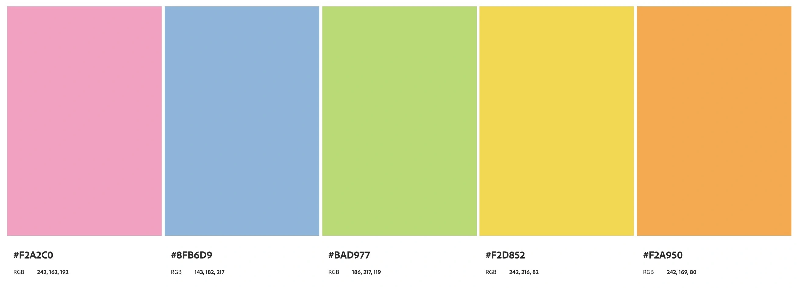
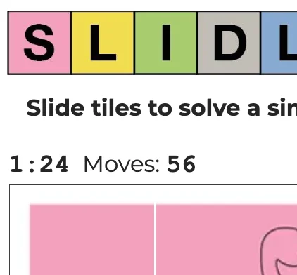
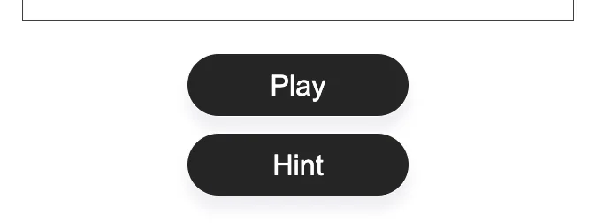
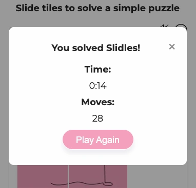
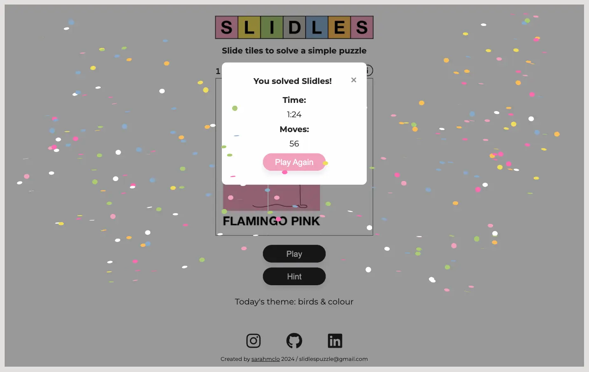
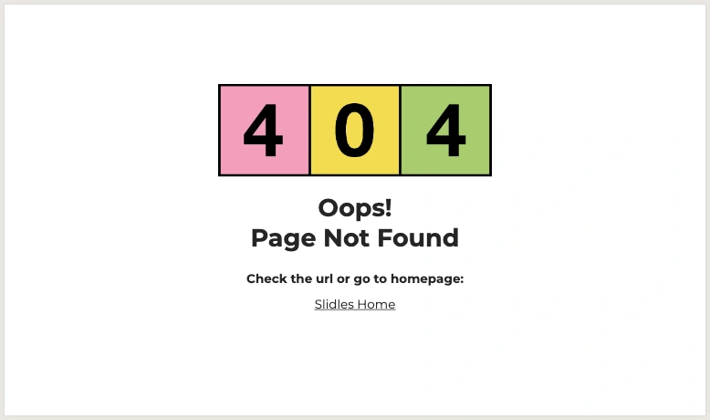
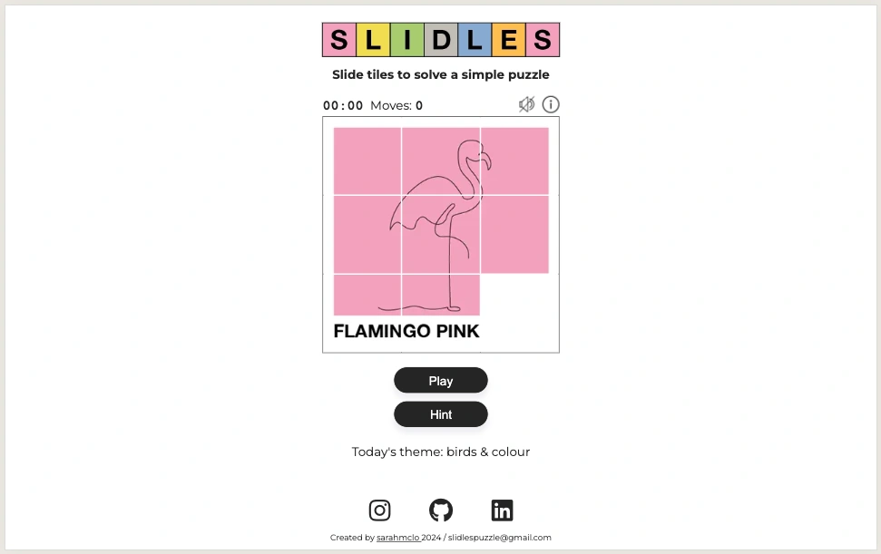
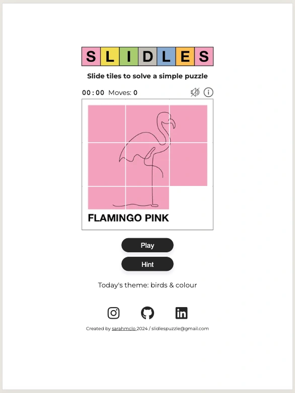

# Slidles

Welcome to Slidles, a vibrant puzzle game designed to keep your brain engaged with quick, satisfying challenges. Slidles combines the classic sliding tile puzzle with a fresh, minimalist design allowing for clean and easy navigation to solve our simple puzzles. Escape for a few minutes to enjoy the bright, eye-catching graphics and clean, intuitive interface. Slidles offers a refreshing experience for players of all ages. Each puzzle is engaging and rewarding, ensuring fun for both novice and seasoned puzzlers. Happy Sliding!

[Click here to play Slidles](https://sarahmclo.github.io/slidles-puzzle/)

## Table of Contents
1. [User Experience (UX)](#user-experience)
    - [Project Goals](#project-goals)
    - [User stories](#user-stories)
    - [Target Audience Goals](#target-audience-goals)
    - [Site Owner Goals](#site-owner-goals)
    - [First Time User Goals](#first-time-user-goals)
    - [Return User Goals](#return-user-goals)
2. [Design](#design)
    - [Design Philosophy](#design-philosophy)
    - [Design Choices](#design-choices)
    - [Colour Scheme](#colour-scheme)
    - [Typography](#typography)
    - [Imagery](#imagery)
    - [Wireframes](#wireframes)
    - [Structure](#structure)
    - [The 5 Elements](#the-5-elements)
3. [Features](#features)
    - [Header](#header)
    - [Main Content](#main-content)
    - [Footer](#footer)
    - [Technologies Utilised](#technologies-utilised)
    - [Languages](#languages)
    - [Frameworks and Programs](#frameworks-and-programs)
5. [Deployment](#deployment)
    - [Remote Deployment](#remote-deployment)
    - [Local Deployment](#local-deployment)
6. [Testing](#testing)
    - [Validation Testing](#validation-testing)
    - [Manual Testing](#manual-testing)
7. [Bugs and Fixes](#bugs-and-fixes)
8. [Finished Product](#finished-product)
9. [Future Features](#future-features)
10. [Credits](#credits)
    - [Content](#content)
    - [Code](#code)
    - [Media](#media)
11. [Conclusion](#conclusion)
12. [Acknowledgements](#acknowledgements)

## User Experience (UX)
Our primary focus is on creating a seamless, enjoyable user experience. Slidles is designed with simplicity in mind, ensuring that users can navigate and play with ease. The vibrant design elements and fun audio enhance engagement, making the puzzle-solving experience delightful and satisfying.

## Project Goals
The main goals of the Slidles project are to:
- Provide an accessible, engaging puzzle game for all ages.
- Combine classic gameplay with a modern, visually appealing interface.
- Ensure a smooth, intuitive user experience across all devices.

## User Stories
- As a user, I want to easily grasp how to play the game intuitively.
- As a user, I want a quick mental challenge that is not overwhelming.
- As a user, I want the design to be visually appealing.
- As a user, I want to find a fun game to return to and share with like-minded people.
- As a user, I want the puzzle to be challenging yet solvable, providing a sense of accomplishment.
- As a user, I want a quick and fruitful escape in my everyday!

## Target Audience Goals
- Enjoy a quick, engaging mental challenge during short breaks.
- Experience a visually pleasing game that is easy to navigate.
- Feel a sense of achievement after solving puzzles.

## Site Owner Goals
- Attract and retain a broad audience with an engaging and well-designed puzzle game.
- Create a community of users who return to the game regularly.
- Ensure the site is easy to maintain and update with new features and puzzles.

## First Time User Goals
- Quickly understand how to play the game.
- Find the interface intuitive and the design appealing.
- Enjoy the initial experience and feel motivated to return.

## Return User Goals
- Experience new puzzles and challenges to keep the game engaging.
- Find improvements and updates that enhance the gameplay.
- Feel a sense of progression and increasing skill.
- Connect with like-minded puzzlers, either through the site or by sharing.

## Design 

### Design Philosophy
Our design philosophy centres on simplicity, vibrancy and user engagement. We believe that a clean aesthetically pleasing design enhances the user's focus on the puzzle itself.

### Design Choices
- **Minimalist Layout**: Ensures the focus remains on the puzzle.
- **Responsive Design**: Provides a seamless experience across all devices.
- **Interactive Elements**: Engages users through dynamic feedback.

- **References**
For my sliding puzzle project, I've drawn inspiration from a blend of traditional sliding puzzles, the minimalist elegance of Pantone colour swatches with the clean lines and abstract forms of Picasso's line drawings to contribute to the overall aesthetic. The puzzle itself is like a polaroid snapshot, while the engaging interactivity of New York Times games inspire and shape the user experience. This fusion of artistic and functional elements create a unique and visually appealing puzzle game.

- ### Colour Scheme
A bright and vibrant colour scheme is used to make the game visually stimulating. Colours are carefully chosen to create a balance between aesthetics and functionality.

- **Colour Palette**
The colour palette for this site was devised in keeping with the original SLIDLES logo and created in [Adobe Color](https://color.adobe.com/).

- **Logo**
The Slidles logo is an original creation using Adobe Illustrator and a starting point for the clean appearance of the puzzle and website.

- ### Typography
Clear, easy-to-read fonts complement the vibrant design without distracting from gameplay.

The font Montserrat was carefully chosen and imported from [Google Fonts](https://fonts.google.com/).
Neue-Helvetica was used in the logo in keeping with design inspiration.
Monospace courier was employed so the timer and moves section do not move around page whilst incrementing.

- ### Imagery
Minimal imagery is used, focusing on the tiles and the puzzle interface to keep the design clean and straightforward.

- **Content Hero Images**
All images were orignially created, optimised and converted to webp with [Convertio](https://convertio.co/).

### Wireframes
Wireframes serve as the blueprint for the website, outlining layout and functionality. They help us visualise the user experience and iterate on design concepts and scope before implementation.

Wireframes for this site were created by pen and with [Figma](https://figma.com/) and include future feature options to solve new puzzles.

- **Sketch Wireframes**

- **Mobile, Tablet, Desktop Wireframes**

### Structure
The structure of Slidles is designed for a seamless and intuitive user experience, with clear content hierarchy, consistent navigation and responsive design principles.

### Content Hierarchy
- **Puzzle Area**: Central focus for gameplay.
- **Timer and Moves Counter**: Visible to track progress.
- **Navigation**: Easy access to puzzles, instructions, and settings.
- **Footer**: Essential links and information.

### Navigation
- **Main Content**: Linked button to start puzzle, modals for instructions and audio.
- **Footer Links**: Additional resources, social media links and contact info.

### Page Structure
- **Header**: Logo and tagline.
- **Main Content**: Main navigation and central puzzle area.
- **Footer**: Social media links and contact details.

### Grid System/Flexbox
- **Flexbox**: Ensures responsive, adaptive layout.
- **Dynamic Resizing**: Elements adjust based on screen size.

### Consistency
- **Design Elements**: Uniform colours, typography, and imagery.
- **Interaction**: Predictable behaviour for interactive elements.
- **Layout**: Consistent across pages and devices.

### Whitespace
- **Enhances Readability**: Avoids clutter and improves focus.
- **Improves Navigation**: Clearly separates sections.

### Responsive Design
- **Mobile-Friendly**: Consistent experience on all devices.
- **Touch-Friendly**: Effective touch inputs.

### Accessibility
- **Screen Reader Support**: Descriptive alt text and ARIA labels.
- **Colour Contrast**: High contrast for visual impairments.

### User Flow
1. **Landing Page**: Main puzzle page with info, audio and hint modals.
2. **Game Start**: Immediate access to gameplay with timer and moves counter.
3. **Gameplay**: Smooth interaction with visible progress.
4. **Completion**: Clear feedback and options to start a new game with audio access and fun confetti to ensure a sense of accomplishment on puzzle completion.

By focusing on these structural elements, Slidles provides an engaging, enjoyable, and accessible experience for all users.

### The 5 Elements
1. **Strategy**: Offering a classic puzzle game with a modern twist.
2. **Scope**: Focus on a well-designed puzzle game.
3. **Structure**: Clear navigation and intuitive gameplay.
4. **Skeleton**: Wireframes ensure a user-friendly layout.
5. **Surface**: Bright, vibrant design elements and pleasing interactive audio create an engaging experience.

## Features

### Header
- **Logo**
A simple, recognisable logo that reflects the game's playful and modern aesthetic, logo is an original creation in Adobe Illustrator.

- **Favicon**
An original creation designed in Adobe Illustrator, this custom favicon stems from the logo which enhances recognition and improves user experience by providing a visual marker for the puzzle site.

### Main Content
- **Timer**
Tracks the time taken to solve each puzzle, adding an element of challenge.

- **Moves**
Counts the number of moves made, encouraging strategic thinking.

- **Info Modal**
A discreet but obvious modal that contains relevant info on how to play.

- **Audio**
Subtle tile sound effects and calming music enhance the interactive experience without being distracting and using off/on toggle for optimal UX. Fun win sound when puzzle is solved for optimum sense of accomplishment.

- **Audio Modal**
Introduced options so user can choose between, music, sfx, both or none, designed for best UX practices in mind. Checkboxes styled in keeping with site.

- **Puzzle**
The core feature, designed to be engaging and rewarding.

- **Buttons**
A clear play button and hint button allow for clear UX in navigating game.

- **Hint Modal**
Displayed to the user for an extra boost on how to solve the puzzle, closes when anywhere onscreen is clicked for simple navigation.

- **Win Modal**
Alerts the user to the puzzle being completed.

- **Theme**
A description of the puzzle and sets the tone, with a view to updating the puzzle themes regularly.

- **Confetti**
Added a burst of confetti on solving the puzzle to optimise user experience and give sense of accomplishment.

### Footer
- **Social Networks**
Contains essential social media links for further engagement.

- **Contact Information**
Displays important info on how to contact creator, with links.

### 404 Error Page
An error webpage displays when a server cannot find the requested URL with simple customised design inkeeping with main site.

## Technologies Utilised 

### Languages

- [**Javascript**](https://developer.mozilla.org/en-US/docs/Learn/JavaScript)
- [**CSS**](https://developer.mozilla.org/en-US/docs/Web/CSS)
- [**HTML5**](https://developer.mozilla.org/en-US/docs/Web/HTML)

### Frameworks and Programs

- [**Gitpod**](https://www.gitpod.io/) Gitpod used for writing code, committing, and pushing to GitHub. 
- [**GitHub**](https://github.com/) GitHub utilised for hosting, viewing and some readme amendments.
- [**Google Fonts**](https://fonts.google.com/) Google Fonts used to import chosen fonts into stylesheet.
- [**Font Awesome**](https://fontawesome.com/) Font Awesome used throughout to add icons in order to create a better visual experience for the user.
- [**Figma**](https://figma.com/) Figma utilised to create wireframes during the design phase.
- [**Responsive Design Checker**](https://responsivedesignchecker.com/) Responsive Design Checker used in the testing process to check responsiveness on various devices.
- [**Am I Responsive**](https://ui.dev/amiresponsive) Am I Responsive utilised to generate Mock Up Image of site in a responsive manner.
- [**Chrome DevTools**](https://developer.chrome.com/docs/devtools) Chrome DevTools utilised frequently during development process for code review and responsiveness tests.
- [**Browserstack**](https://www.browserstack.com/) Browserstack employed to test browser compatility across multiple devices.
- [**Shields.io**](https://shields.io/) Shields.io used to generate dynamic badges for Readme.
- [**Coolers Contrast Checker**](https://coolors.co/) Coolers Contrast Checker used to make sure colours contrasted well correctly for optimal accessibility.
- [**Adobe Colors**](https://color.adobe.com/) Adobe Colors helped to generate a pleasing colour palette in keeping with logo and overall design.
- [**Convertio**](https://convertio.co/) Convertio utilised to optimise images to webp for fast loading.

## Deployment 

Git was used for version control. Version control was done locally and remotely. For remote version control, GitHub was used. Regular commits were made after each file change.

### Remote Deployment

GitHub Pages was used to deploy the site remotely.

1. Login to [Git Hub](https://github.com/) Repository account
2. Navigate to my project repository slidles-puzzle
3. Click the Settings near the top of the page
4. In the left-hand menu, find and click on the Pages
5. In the Source section, choose 'main' from the drop-down, select branch menu
6. Select 'root' from the drop-down folder menu
7. Click 'Save'
8. Project now live and a link is visible at the top of the page "Your site is published at (https://github.com/sarahmclo/slidles-puzzle) 

### Local Deployment

To contribute or check the code, you can:
- Fork the repository
- Clone the repository

### How to Fork
1. To fork, go the repository
2. Click on the Fork button in the top left corner of the page
3. Fill in the form with either keep the name or create a new name for the repository

### How to Clone
1. To clone, go to repository
2. Click on the Code button above the repository files
3. A drop-down will appear and choose either
4. Go to your terminal and decide where you want to clone the files
5. Use the copy/paste button and copy it into your terminal
6. You also have the option to download a ZIP file of the code

## Testing 

### Validation Testing
## HTML
- ### Index Page ###

- ### 404 Error Page ###

## CSS

## Javascript

## Accessibility

### Lighthouse Testing
- **Desktop**

- **Mobile**

### Semantic HTML

Semantic HTML tags were used to provide a clear and meaningful structure to the website content. This helps screen readers and other assistive technologies interpret and convey information accurately.

### ARIA (Accessible Rich Internet Applications)

ARIA attributes were utilised on links to enhance the accessibility of the site allowing for screen readers to accurately pick up information.

### Contrast and Readability

Coolers Contrast Checker was used to ensure sufficient contrast in colours chosen to make the content readable for users with visual impairments.

### Alt Text for Images

All images on the website include descriptive alternative text (alt text). This helps users with visual impairments understand the content and context of images even if they cannot see them.

### Responsive Design

The website is responsive, providing a seamless experience across various devices and screen sizes. This benefits users with different abilities and ensures a consistent and accessible user experience. Tested via Chrome DevTools and Responsive Design Checker as project progressed.

### Manual Testing

Manual testing for the site involves hands-on evaluation by human testers to ensure functionality, usability, and compatibility across various devices and browsers. By conducting the manual testing procedures below, we ensure the website functions smoothly, provides an optimal user experience, and meets desired standards.

Puzzle lpayed and tested on various devices to ensure they function correctly and without errors. Checked that puzzle completion is accurately tracked and that the site provides appropriate feedback and rewards upon solving puzzles. Tested audio, modals, buttons and social links to ensure all functioning efficiently.

| Testing | Description | Browser | Device | Fixed | Responsive |
|-------------|-----------------------|---------|--------|----------|----------|
| **Navigation Testing:** | Manually testing to ensure navigation is clear and intuitive, puzzle site should be functional and fun fun and consistent. | Chrome, Safari, Firefox | Desktop, Laptop, Tablet, Mobile | Yes | Yes |
| **Responsive Design Testing:** | Testing the website on various devices (desktop, mobile, tablet) has ensured responsiveness and proper layout adaptation. It is verified that all content remains accessible and readable across different screen sizes. | Chrome, Safari, Firefox | Desktop, Laptop, Tablet, Mobile | Yes | Yes |
| **Content Hierarchy Testing:** | Reviewed the arrangement of content on each page to ensure a logical flow and easy readability. Confirmed that headings, subheadings, modals and buttons text are displayed in a clear and hierarchical manner. | Chrome, Safari, Firefox | Desktop, Laptop, Tablet, Mobile | Yes | Yes |
| **Cross-browser Compatibility Testing:** | The website has been tested on different web browsers in Browserstack (Chrome, Firefox) to ensure compatibility and consistent performance. Layout and functionality issues specific to certain browsers have been addressed accordingly. | Chrome, Safari, Firefox | Desktop, Laptop, Tablet, Mobile | Yes | Yes |
| **Page Structure Testing:** | Ensured that all pages have a consistent structure and layout. Verified that essential elements like headers, footers, and sidebars are present and correctly positioned on every page. | Chrome, Safari, Firefox | Desktop, Laptop, Tablet, Mobile | Yes | Yes |
| **Accessibility Testing:** | Assessed the site using tools like screen readers to confirm that it is accessible to users with disabilities. Verified the presence of alt text for images, proper use of ARIA roles, and keyboard navigability. | Chrome, Safari, Firefox | Desktop, Laptop, Tablet, Mobile | Yes | Yes |
| **Performance Testing:** | Measured the site's loading times and responsiveness under different network conditions. Ensured that pages load quickly and efficiently, optimizing any elements that cause significant delays. | Chrome, Safari, Firefox | Desktop, Laptop, Tablet, Mobile | Yes | Yes | 

## Bugs and Fixes 

Throughout the development process, we encountered and resolved various bugs to ensure a smooth and seamless user experience. Our rigorous testing procedures helped identify and address these issues promptly.

- ### Mark-up Validation Testing Bugs ###
|Bug / Errors | Where / Location site | Browser | Device | Fixed | Solution |
|-------------|-----------------------|---------|--------|:-----:|----------|
| Timer-moves-audio-info-container: get all on one line| Main content index.html | Chrome, Safari, Firefox | Desktop, Laptop, Tablet, Mobile | Yes | Use flexbox to and gap to space correctly  |
| Audio - sound effect bug - not playing fast enough | Main content index.html | Chrome, Safari, Firefox  | Desktop, Laptop, Tablet, Mobile | Yes | Update to new trimmed audio and add preload:auto; to html |
| Audio - stops after one play | Main content index.html | Chrome, Safari, Firefox  | Desktop, Laptop, Tablet, Mobile | Yes | Use loop |

- ### CSS Validation Testing Bugs ###

|Bug / Errors | Where / Location site | Browser | Device | Fixed | Solution |
|-------------|-----------------------|---------|--------|:-----:|----------|
| Moves & timer move around whilst incrementing| css/js.script | Chrome, Safari, Firefox  | Desktop, Laptop, Tablet, Mobile | Yes | Use monospace font |

- ### Javascript Testing Bugs ###
|Bug / Errors | Where / Location site | Browser | Device | Fixed | Solution |
|-------------|-----------------------|---------|--------|:-----:|----------|
| audio on-click| js.script | Chrome, Safari, Firefox  | Desktop, Laptop, Tablet, Mobile | Yes | Use on-click toggle |
| js hint says variable togglePlay not in use| js.script | Chrome, Safari, Firefox  | Desktop, Laptop, Tablet, Mobile | Yes | Assign togglePlay in javascript not html - adapted from: https://stackoverflow.com/questions/27368778/how-to-toggle-audio-play-pause-with-one-button-or-link |
| Puzzle grid | html/js.script | Chrome, Safari, Firefox  | Desktop, Laptop, Tablet, Mobile | Yes | Use background url and css grid https://developer.mozilla.org/en-US/docs/Web/CSS/CSS_grid_layout|
| Puzzle-container make gaps in grid to section tiles| css | Chrome, Safari, Firefox  | Desktop, Laptop, Tablet, Mobile | Yes | Use css display: grid and style grid-gap |
| puzzle image not showing| css | Chrome, Safari, Firefox | Desktop, Laptop, Tablet, Mobile | Yes | Change cell ids to represent columns 1,2,3 and row1,2,3 |
| Puzzle image not lining up| css | Chrome, Safari, Firefox  | Desktop, Laptop, Tablet, Mobile | Yes | Update tile dimensions true to size of image, essential that width and height exact for image to display in correct aspect ratio and image shown completely |
| tile borders | css | Chrome, Safari, Firefox  | Desktop, Laptop, Tablet, Mobile | Yes | Amend border to surrounding container rather than each individual tile |
| Shuffle tiles when playButton clicked | js.script | Chrome, Safari, Firefox  | Desktop, Laptop, Tablet, Mobile | Yes | Use tile direction array, shuffle() function and math.floor https://stackoverflow.com/questions/57907979/javascript-shuffle-table-rows //https://developer.mozilla.org/en-US/docs/Web/JavaScript/Reference/Global_Objects/Math/random |
| playButton and tiles not working| js.script | Chrome, Safari, Firefox  | Desktop, Laptop, Tablet, Mobile | Yes | Use document.getElementByquerySelector("playButton") incorrect id remove getElementBy and declare gameStarted variable|
| Shuffle function incorrect | js.script | Chrome, Safari, Firefox  | Desktop, Laptop, Tablet, Mobile | Yes | Add parentheses |
| playButton not working| js.script | Chrome, Safari, Firefox | Desktop, Laptop, Tablet, Mobile | Yes | Event Listener incorrect - amend |
| playButton not shuffling| html/js.script | Chrome, Safari, Firefox  | Desktop, Laptop, Tablet, Mobile | Yes | Add onClick="shuffle"() in html |
| playButton not shuffling| js.script | Chrome, Safari, Firefox  | Desktop, Laptop, Tablet, Mobile | Yes | Remove stray comma that was within code |
| After game has commenced playButton effects timer and moves - timer is speeding up and extra moves added when clicked - should just shuffle tiles only | js.script | Chrome, Safari, Firefox  | Desktop, Laptop, Tablet, Mobile | Yes | Add function and event listener to play button which allows playButton to only shuffle at start of game |
| Close hint modal bug | html/css/js.script | Chrome, Safari, Firefox  | Desktop, Laptop, Tablet, Mobile | Yes | no "." in event.target |
| Alert occurs when page is loaded as puzzle is solved | js.script | Chrome, Safari, Firefox  | Desktop, Laptop, Tablet, Mobile | Yes | Remove isSolved from reset game |
| Alert occurs before last tile has moves | js.script | Chrome, Safari, Firefox  | Desktop, Laptop, Tablet, Mobile | Yes | Add setTimeout to stop alert from showing before last tile has moved https://developer.mozilla.org/en-US/docs/Web/API/setTimeout |
| Remove numbers display on tiles | js.script | Chrome, Safari, Firefox  | Desktop, Laptop, Tablet, Mobile | Yes | Use font-size 0 |
| Change initial win alert to a modal and link play button | js.script | Chrome, Safari, Firefox  | Desktop, Laptop, Tablet, Mobile | Yes | Make new play again modal, insert play button |
| Add users fin time and moves to win modal | js.script | Chrome, Safari, Firefox  | Desktop, Laptop, Tablet, Mobile | Yes | Use .textcontent and template literal |
| Fix time display in modal to match game, so time displays as 00:00 | js.script | Chrome, Safari, Firefox  | Desktop, Laptop, Tablet, Mobile | Yes | Copy timer display: add toString().padStart |
| Uncaught ReferenceError: Cannot access 'jsConfetti' before initialization at puzzleSolved | js.script | Chrome, Safari, Firefox | Desktop, Laptop, Tablet, Mobile | Yes | Move confetti variable to before the puzzleSolved funcation call |
| Tile slide sound effect is playing even though volume-icon is off | js.script | Chrome, Safari, Firefox | Desktop, Laptop, Tablet, Mobile | Yes | Spelling mistake is click sound function. Fixed spelling mistake! |
| Ensure audio plays without delay on mobile, tablet and across all browsers. | html/js.script | Chrome, Safari, Firefox | Desktop, Laptop, Tablet, Mobile | Yes | Use Howler.js https://github.com/goldfire/howler.js?tab=readme-ov-file#documentation and employ a cdn in the script |
| "AudioContext was not allowed to start. It must be resumed (or created) after a user gesture on the page." | js.script | Chrome, Safari, Firefox | Desktop, Laptop, Tablet, Mobile | Yes | Move script to js.html and add event listener |

- ### Puzzle Grid Practice ###
[Codepen](https://codepen.io/) Codepen utilised to practice and troubleshoot grid code ideas and bugs.

## Finished Product 
Our Slidles puzzle combines the classic challenge of traditional sliding puzzles with the modern simplicity of Pantone colour swatches and the artistic touch of Picasso line drawings. The engaging gameplay, inspired by New York Times games, offers a visually striking and mentally stimulating experience. Perfect for both casual gamers and puzzle enthusiasts, Slidles is a beautiful blend of art and play.

Mobile

Desktop

Tablet

404 Error Page

## Future Features 
- New puzzles, with levels and increasing challenges.
- Additional themes and colour schemes.
- Social sharing features to engage with friends and further the reach of Slidles.

## Credits 

### Content

* Puzzle, text and imagery all original creations.
* [Code-Institute](https://codeinstitute.net/ie/?nab=0) Walkthrough projects content.
* [MDN](https://developer.mozilla.org/en-US/) Web docs and tutorials.
* [StackOverflow](https://stackoverflow.com/) Troubleshooting code.
* [W3Schools](https://www.w3schools.com/) Javascript intro tutorials
* [CSS Tricks - HTML Picture](https://css-tricks.com) Further CSS tutorials.
* [Web Dev](https://web.dev.com) Tutorials in javascript and responsivity.
* [Flexbox](https://css-tricks.com/snippets/css/a-guide-to-flexbox/) Flexbox tutorials.
* [Codu](https://www.codu.co/) Inspiration.
* [Gitpod](https://www.gitpod.io/) Write, commit and push code to GitHub. 
* [GitHub](https://github.com/) Utilise for hosting, amending and viewing.
* [Figma](https://figma.com/) Create the detailed low-fidelity wireframes in the design phase.
* [Codepen](https://codepen.io/) Practice and troubleshoot code ideas/bugs.
* [JShint](https://jshint.com/) Javascript code validation and troubleshooting.
* [Responsive Design Checker](https://responsivedesignchecker.com/) Test responsiveness on various devices.
* [Am I Responsive](https://ui.dev/amiresponsive) Generate Mock Up Image of site in a responsive manner.
* [Chrome DevTools](https://developer.chrome.com/docs/devtools) Utilised regularly in development for code review and to test responsiveness.
* [Browserstack](https://www.browserstack.com/) Browserstack was utilised to test browser compatility across multiple devices.
* [NPMJS](https://www.npmjs.com/package/js-confetti) Tutorial to add confetti when puzzle is solved.
* [Shields.io](https://shields.io/) Shields.io used to create dynamic badges for Readme.
* [Google Fonts](https://fonts.google.com/) Import carefully selected fonts.
* [Coolers Contrast Checker](https://coolors.co/) Ensure colour contrast inline with guidelines.
* [Adobe Colors](https://color.adobe.com/) Generate pleasing colour palette in keeping with logo and overall design.

### Code
* [MDN Web Docs](https://developer.mozilla.org/en-US/docs/Web/CSS/CSS_grid_layout) CSS Grid Layout explaining the grid structure thoroughly in HTML & CSS.
* [NPMJS](https://www.npmjs.com/package/js-confetti) Confetti effect on win - adapted from tutorial to use canvas on win not on button.
* [DEV](https://dev.to/ctrlcoding/how-to-create-a-simple-audio-player-in-html-javascript-and-css-4l2e) Add simple audio tutorial.
* [MDN](https://developer.mozilla.org/en-US/docs/Glossary/Grid_Cell) Grid styling and cells - use one image and create cells rather than importing multiple images.
* [Stackoverflow](https://stackoverflow.com/questions/57907979/javascript-shuffle-table-rows) Adapt code shuffle tiles tiles.
* [MDN](https://developer.mozilla.org/en-US/docs/Web/JavaScript/Reference/Global_Objects/Math/random) Using math random for tile diections, positions and moves.
* [W3 Schools](https://www.w3schools.com/jsref/jsref_indexof_array.asp) Array Index tutorials.
* [Stackoverflow](https://stackoverflow.com/questions/55018585/how-to-turn-on-audio-on-click-icon-play-pause) Audio toggle on/off for enhanced UX.
* [Stackoverflow](https://stackoverflow.com/questions/27368778/how-to-toggle-audio-play-pause-with-one-button-or-link) Play and pause audio using icon.
* [W3 Schools](https://www.w3schools.com/howto/howto_css_modals.asp) Use modals instead of alert for info and win, optimises user navigation and experience.
* [W3 Schools](https://www.w3schools.com/jsref/met_win_settimeout.asp) Add timeout to puzzle if not played for a certain amount of time.
* [Sentry](https://sentry.io/answers/how-to-style-a-checkbox-using-c) Style checkbox - simple tutorial on changing colour and height of checkbox.
* [Howler.js](https://github.com/goldfire/howler.js?tab=readme-ov-file#documentation) Ensure audio plays without delay on mobile, tablet and across all browsers.
* [Flexbox](https://css-tricks.com/snippets/css/a-guide-to-flexbox/) Flexbox tutorials.

### Media
* [Adobe Illustrator](https://www.adobe.com/) All original imagery created in Adobe Illustrator.
* [FontAwesome](https://fontawesome.com/) Icons for social networks.
* [Favicon](https://favicon.io/) Created my own favicon from logo.
* [Convertio](https://convertio.co/document-converter/) Images converted to webp for optimal loading.
* [Pixabay](https://www.pixabay.com) Audio (carl-orff-gassenhauer-hans-neusiedler-180891.mp3) and tile slide sound effect.
* [The Noun Project](https://www.google.com/maps) Icons for info modal and volume on/off.
* [Freesound](https://freesound.org/people/MLaudio/sounds/615099/) Win sound effect.
* [NPMJS](https://www.npmjs.com/package/js-confetti) Confetti effect on win.

## Conclusion 
Slidles merges the timeless appeal of sliding puzzles with contemporary design elements, creating a visually captivating and intellectually engaging experience. Our aim is to offer a puzzle site that not only challenges the mind but also delights the senses, making it an ideal destination for both casual players and avid puzzle enthusiasts. Through Slidles, we strive to bring the joy of puzzles to a wider audience, blending art and entertainment in perfect harmony.

## Acknowledgements 
- Rahul Lakahanpal, my wonderful mentor.
- Amy Richardson, my course facillitator for calmly and consistently sharing invaluable resources.
- Fellow brilliant course students for sharing.
- Our Slack community for resources and daily motivation.
- Ed B_alum in CI Slack for sharing valued info on audio woes.
- Ozzy the dog on breaks. 
- My own childhood tile-sliding puzzle for inspiration.

[🔼 Back to top](#Slidles)
